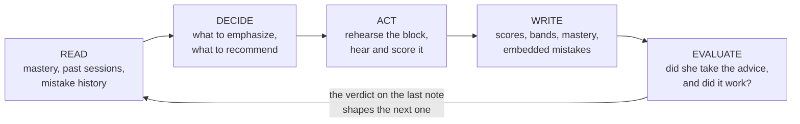
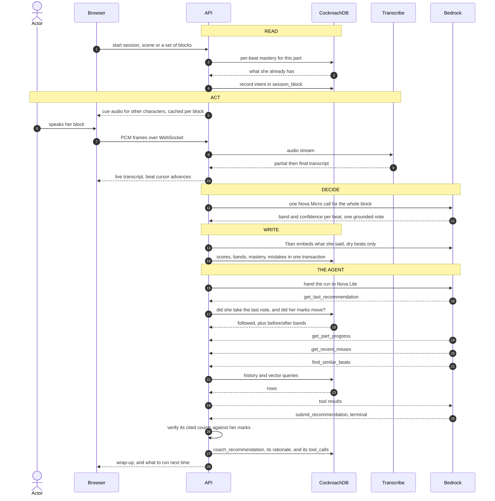
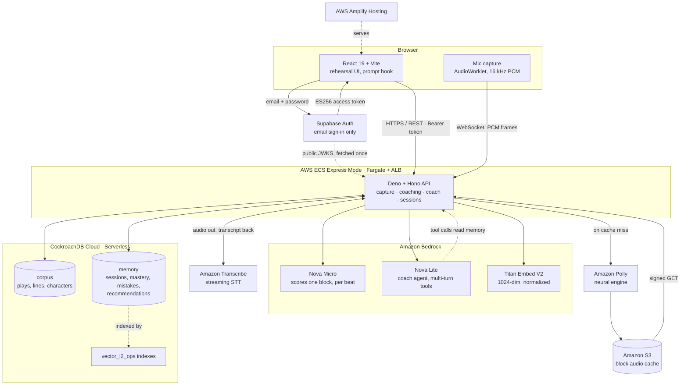

# 📖 The Book Holder

**Rehearse a play when your scene partner isn't available.**

The Book Holder voices every character but yours, listens while you say your lines, remembers what you
have mastered and coaches you what to work on next time. All in real-time, all on your own time.

**▶️ Live: <https://bookholder.chillbrodev.com/>**  ·  MIT licensed  ·  Built for the **CockroachDB × AWS
Hackathon: Build with Agentic Memory**

---

## The story

An actress returns to the career she left decades ago, and picks Shakespeare. Learning a part means saying it out loud, over and over, with somebody feeding you the other lines. Her partner is willing but not always available, and not always in the mood to read *The Merry Wives of Windsor* at 6am.

That is the whole problem. It is not a technology problem, it is a scheduling problem, and it is why actors have used a "book holder" since Shakespeare's own company: the person backstage holding the script, feeding you the line when you dry.

This app is that person. It reads the other parts aloud in distinct voices, follows along while you speak, notices which of your lines are solid and which you are still reaching for, and remembers all of it between sessions. The memory is the point. A rehearsal partner who forgets everything the moment you close the app is just a tape recorder.

It generalizes past one household: community theater, drama students, ESL learners practicing dialogue. Anyone who needs a patient partner more often than they can get one.

The focus play is *The Merry Wives of Windsor*, but nothing is hardcoded to it. The importer parses the full Moby Shakespeare corpus, so adding a play is a data import, not a schema change.

---

## Two decisions that shaped everything else

Most of what follows is architecture. These two are product, and they came first.

### This is line mastery, not direction

The Book Holder tells you whether you **know** the lines. It will never tell you how to **play** them.

That boundary is deliberate. There is no correct inflection for a Shakespeare line; that is the art form. Two great actresses play Mistress Quickly completely differently and both are right. A model scoring delivery would be asserting a correctness that does not exist, to someone whose instincts are the very thing she is rebuilding. Accent is the sharpest case: an app telling a returning actress that her natural speech is wrong would be a real harm, not a hypothetical one.

It is also a failure mode we hit for real. The coaching rubric needed three revisions specifically to stop it critiquing punctuation she never typed, because it did not understand it was reading a speech-to-text transcript. Grading inflection is that same mistake with the volume turned up.

So scoring runs on text, on purpose. We evaluated the alternative honestly: `us-west-2` offers exactly two models that accept speech (`amazon.nova-2-sonic-v1:0` and `mistral.voxtral-mini-3b-2507`), and neither of the models we use for scoring or agent reasoning takes audio at all. But availability was never the deciding factor. Her director gives the other note. The book holder holds the book.

### We don't record you

Your voice is **never stored**. Mic audio streams to Amazon Transcribe, is transcribed in flight, and is gone. It is never written to disk, never written to S3, and there is no recordings bucket. The only audio this app stores is synthesized *character* speech from Polly: public-domain text read by a machine.

What persists is text. The transcript of each beat, its score, and (only for beats you actually fumbled) a vector embedding of what you said, so the coach can notice you have missed this line before.

An account is an email address and a password, and neither is ours: Supabase holds them. This database has no `users` table at all — a rehearsal row is stamped with the Supabase user's id and nothing else, so the most personal thing we store about you is which lines you keep forgetting.

This began as a deferred feature and became a stance. Rehearsal is where you are allowed to be bad at something, and a room that records you is a different room. Storing personal audio would also mean owing a retention window and a delete path, obligations worth taking on only for a feature that earns them.

The honest counter-argument is written up in `docs/OPEN_ITEMS.md` §1e: recordings would give us **ground truth**. When the app says you missed a beat, nothing today can prove whether you fumbled it or Transcribe mangled it. That ambiguity is what still blocks our confidence thresholds. We kept the stance and kept the tension documented rather than quietly resolving it in our own favor.

---

## Judging criteria

| Criterion | Where to look |
|---|---|
| **Agentic Memory Design** | `api/src/features/coach/`. A tool-calling agent with four read tools over its own history. Its recommendations are stored, checked against what she went on to run, **and graded against whether her marks improved** — so the next note is shaped by whether the last one worked. |
| **Technical Implementation** | `infra/cockroachdb/migrations/`. Twelve migrations, each carrying its reasoning. Real vector search over 1,636 embedded beats. MCP Server, `ccloud`, and Agent Skills all in use. |
| **Real-World Impact** | The story above. Built for one specific person, generalizing to anyone who cannot get a rehearsal partner on their schedule. |
| **Production Readiness** | OIDC deploys with no long-lived credentials. CI that refuses to deploy when the task role is behind the code. Graceful degradation to a deterministic scorer when Bedrock is unreachable. An audio-duration guard that discards implausible renders rather than caching them. |
| **Creativity & Originality** | Memory here is a *skill model over time*, closer to spaced repetition for embodied performance than to chatbot fact-memory. The agent is allowed to recommend nothing, which is what keeps a recommendation worth reading — and it has to show its working in her own marks, checked against the database before she sees it. |

---

## The memory loop

The design principle behind every technical decision here: **the agent reads memory to decide what happens next, writes memory as a direct result of what happened, and then grades its own advice against what changed.** Not logging. Not a dashboard. The read changes the behavior, and the outcome changes the next read.



**EVALUATE is the step most agent demos skip**, and it is the one that makes the rest more than a log. When she acts on a recommendation the session records which recommendation it came from, so the next run the agent can ask not only *"did she do what I said"* but *"and did it help"* — the bands on those speeches when it gave the advice, against the bands now. If the advice worked it says so and moves on. If she took it and nothing improved, the brief tells it in as many words that **the advice was wrong**: do not repeat it, change the angle.

**Before a session.** The agent reads per-*beat* mastery for the chosen scene. A beat is one thought, and it is the unit of scoring throughout (see "Beats and blocks" below; it is not a line of verse).

**During a session.** Your line streams to Amazon Transcribe over a WebSocket, with partial results shown while you are still speaking. A beat cursor aligns the growing transcript against the expected text so the app knows which thought you are on, tolerating the places where a 400-year-old printed text and a modern transcriber disagree without either being wrong.

**After each block.** One Bedrock call covers a whole speech and returns a judgement per beat. Scores, bands, and mastery all commit in a single serializable transaction. Only *dry* beats go to `mistake_log`, and only what you actually **said** gets embedded: a blank has nothing to cluster on, and embedding the expected text instead would mix "what she said" and "what she should have said" into one vector space.

**At the wrap-up.** A tool-calling agent takes over. This is the part that makes it agentic rather than generative. The wrap-up also shows the run back beat by beat — every speech, each beat marked *solid*, *close* or *dry* — because the memory the agent reasons over should be the same memory she can see.

**Before the next one.** The recommendation is on the play page too, not only at the end of a scene. Waiting until a scene is finished is a long time to wait to see the thing decide something, and advice about what to work on is most useful on the way in. That screen *reads* the standing recommendation and never runs the agent: it is visited constantly, and re-running would bill a loop per visit and reword yesterday's advice each time, which is what makes advice feel arbitrary.

### The agent

Nova Lite, running a real multi-turn tool loop (`api/src/features/coach/`). It is handed the run that just finished and decides for itself what to look up:

| Tool | Answers |
|---|---|
| `get_part_progress` | How much of this part does she have? Totals, plus a per-scene breakdown of what she ran and whether she finished it. |
| `get_recent_misses` | Which beats does she keep getting wrong, worst first, including what she said instead. |
| `get_last_recommendation` | What did I tell her last time, did she do it, **and did it work?** Returns the bands on those speeches when the advice was given against how they stand now. |
| `find_similar_beats` | Is this mistake isolated or a pattern? Similar in *meaning*, not wording. Vector search. |
| `submit_recommendation` | Terminal. Calling it *is* the answer. Four separate fields — the note, what keeps happening, what to do, and why this speech — because asking for one free-text sentence got one back that was nothing but the line, every time. |

Five choices worth defending:

**It is allowed to say nothing.** `submit_recommendation` accepts `action: 'none'`. It is deliberately not a forced `toolChoice`, because a run with nothing worth saying should say nothing rather than invent a drill. An assistant that always has advice is an assistant whose advice is worthless.

**Its recommendations are checkable, and the loop is actually closed.** Every recommendation writes to `coach_recommendation` with the tool calls that produced it. Acting on one carries its id into the rehearsal, which stamps `followed_session_id` on the row as the session opens and tags the blocks `source = 'coach'`. So it can ask the question a stateless model cannot — *"last time I said run these three, you ran two"* — and the harder one after it: *"and their marks did not move."* Two signals are kept rather than one, because they differ where it matters: she **took it up** (tapped the recommendation) and she **followed** it (every recommended speech actually got scored, however she got there — running the whole scene instead of the drill is following the advice by a better route).

**It has to show its working.** A recommendation carries a rationale in her own marks — *"The speech has 11 beats, with 2 solid, 8 close, and 1 dry"* — from a per-speech tally the tools hand it. That turns an instruction into an argument she can disagree with, which is the difference between a coach and a notification.

**What can be checked is checked in code, not asked for in the prompt.** Three times now the same lesson: the rubric could not stop the scorer inventing notes (`groundedNote` drops any note sharing no three-word run with the speech), the brief could not stop the agent returning the quoted line and nothing else (`isBareQuotation` rejects it and rebuilds from structured fields), and the tool description could not stop it citing numbers that were not hers. The last one shipped and was caught: it reported *two of nine beats dry* where the truth was *one of eleven*, having copied the example sentence out of the schema verbatim. Every figure in a rationale is now verified against the database, and an invented one is replaced with a composed sentence that is merely true. **A model will not be argued into a rule a machine can check.**

**Its reasoning is inspectable.** `tool_calls JSONB` exists for exactly one reason: being able to answer "why did it say that" without re-running it. An agent whose reasoning cannot be audited is very hard to trust and harder to debug.

Full design: `docs/coaching-plan.md`.

### One block, end to end

The loop above, with the actual services in it. This is the whole product in one picture: everything before
"THE AGENT" happens while she is still in the room, and everything in it happens because the previous
sessions were written down.



The first two exchanges are the loop closing. The agent's opening move is to look
up its own last note and what happened to it — which is only answerable because
acting on a recommendation writes `followed_session_id` back onto it.

---

## Architecture



Four things this is meant to make obvious:

- **No AWS credential ever reaches the browser.** Every Bedrock, Polly, Transcribe and S3 call routes through
  the API, which holds an ECS task role in production and a scoped IAM user locally. The same client code
  runs in both; nothing branches on environment.
- **The corpus and the memory are the same database but not the same thing.** The corpus is derived from
  public-domain text and is identical for everyone. The memory is hers, and it is the only part that makes
  the second session differ from the first.
- **The agent's arrow points back at the API.** Nova Lite does not receive a prepared summary; it calls tools
  that query CockroachDB, and decides for itself what to look up. That arrow is the difference between an
  agent and a prompt with a database attached.
- **No password ever reaches the API either.** The sign-in arrows run browser-to-Supabase and stop there;
  the only Supabase arrow touching the API is the dotted one, a public key fetched once. Everything the API
  sees is a token it verifies offline — so there is no auth secret in the container, and an identity outage
  cannot interrupt a rehearsal already under way.

---

## CockroachDB

Five tools, each doing real work — and worth separating, because the question is
what the *agent* does with them. **Vector indexing is agent-facing**: the coach
calls `find_similar_beats` mid-loop and the answer changes its recommendation.
**CockroachDB Cloud is the memory itself**, read and written on every rehearsal.
The MCP Server, `ccloud` and the Agent Skills were used by *us* building it, and
are listed as that rather than dressed up as runtime integrations.

| Tool | How it is used |
|---|---|
| **CockroachDB Cloud (Serverless)** | The memory layer itself. Session writes are multi-statement serializable transactions with retry handling. The free tier is what makes an out-of-pocket build viable. |
| **Vector indexing and search** | `migrations/007_vector_index.sql`. L2 (`vector_l2_ops`) indexes over `lines.embedding` and `mistake_log.embedding`. All **1,636 beats are embedded**, and `find_similar_beats` runs genuine nearest-neighbour search over what she has misremembered before. |
| **CockroachDB Cloud MCP Server** | Connected in development, authorized READ + WRITE, used **read-only in practice**. Every schema and data change goes through `infra/cockroachdb/migrate.ts` or the importer, so the migration files stay the single source of truth. |
| **`ccloud` CLI** (0.8.23) | Cluster inspection and connection management. Deliberately *not* scripted into `infra/`: the cluster already existed, so there is nothing to provision. Documented as a deliberate non-goal in `docs/PROJECT_PLAN.md` rather than left as a mystery. |
| **CockroachDB Agent Skills** | 34 skills vendored at `.agents/skills/`. They earned their place: the schema-design reference is where we learned CockroachDB supports **three** vector distance operators (`<->`, `<=>`, `<#>`), not L2 alone, which corrected a claim in our own design doc. |

### Two things that cost us real time

**A probe vector must be a bound parameter, never a subquery.**

```sql
ORDER BY embedding <-> (SELECT embedding FROM lines WHERE id = '…')  -- FULL SCAN
ORDER BY embedding <-> $1::VECTOR                                     -- • vector search
```

Both return identical rows. At 1,636 rows both return them fast. Nothing about the result distinguishes them and there is no warning. Only `EXPLAIN` tells you. The same silent fallback happens if the query operator does not match the index op class.

**`BEGIN` … DDL … `ROLLBACK` does not undo the DDL.** CockroachDB runs schema changes as asynchronous jobs, so the standard Postgres trick for dry-running a migration leaves the objects behind. The `ROLLBACK` returns successfully and `information_schema` still reads the objects inside the same session, so it looks like it worked. We verified this the expensive way: migration 006 was "validated" like that and persisted. There is no safe dry run here. Read the SQL, then apply it.

Every migration in `infra/cockroachdb/migrations/` carries its reasoning in the file header. `007_vector_index.sql`, `008_session_scope.sql`, and `009_beat_band.sql` are each worth reading on their own; `011_supabase_auth.sql` explains why this database stopped holding users at all, and `012_coach_rationale.sql` why the agent's reasoning is a column rather than more sentences in its note.

---

## AWS

Ten services, all load-bearing.

| Service | Job |
|---|---|
| **Amazon Bedrock** | Three models, three jobs. Nova Micro scores beats, Nova Lite runs the coach agent, Titan Text Embeddings V2 produces the vectors. |
| **Amazon Transcribe** | Streaming speech-to-text over a WebSocket, with partial results so she sees the app hearing her while she is still speaking. |
| **Amazon Polly** | Every character's voice but hers. Neural engine, one voice per character, cached per block. |
| **Amazon S3** | The Polly cache, keyed `{play}/{character}/{blockId}__{voiceId}__{engine}.mp3`. |
| **AWS ECS Express Mode** (Fargate) | Runs the Deno API and auto-provisions its own ALB with TLS, which mic capture's secure-context requirement makes non-optional. |
| **Amazon ECR** | Container images, built arm64 in CI. |
| **AWS Amplify Hosting** | The frontend, building off the same push to `main`, independently. |
| **AWS Secrets Manager** | `COCKROACHDB_URL` and `ALLOWED_ORIGIN` into the running task. No secrets in the image or the repo. |
| **AWS IAM** | GitHub OIDC for deploys (no long-lived keys anywhere) plus a scoped task role for runtime. |
| **AWS Budgets** | A small-dollar alert configured on day one, because this is out of pocket. |

### Bedrock ARN shapes are not interchangeable

This cost more debugging than anything else in the build, so it is worth stating plainly.

Invoking a model through a **geo inference profile** requires *two* ARN shapes in the policy: the `inference-profile` ARN **and** the bare `foundation-model` ARN in every region the profile can route to (`us-east-1`, `us-east-2`, `us-west-2`). Grant only the profile and you get an `AccessDenied` naming a region that appears nowhere in your deployment.

Titan is the exact opposite: in-region, no profile, one bare foundation-model ARN. Pattern-matching one onto the other fails in both directions.

The `us.` prefix on `us.amazon.nova-micro-v1:0` is load-bearing for the same reason. Nova Micro has no in-region presence in `us-west-2`, so the bare id fails with an error that reads like a bad model name rather than a regional gap.

Consequence: **adding or changing a model is two files, never one config string.** Both `infra/aws/task-role-policy.sh` and `infra/aws/create-dev-user.sh` carry the grants.

We fixed the signal rather than writing a checklist. The deploy workflow now diffs the live task role against `task-role-policy.sh` and **refuses to deploy** when the role is behind the code, because the alternative is a green deploy that fails at runtime. It caught a real miss: the task role had no Bedrock grants at all. CI deliberately holds no IAM write permission, so applying the fix stays a human step.

---

### Known gaps

Stated plainly, because a README that claims everything works is not worth reading:

- Session recordings are not built, deliberately (see "We don't record you").
- Confidence thresholds are not fitted to real data yet; `docs/OPEN_ITEMS.md` §1a tracks it.
- `GET /sessions/plan` has no caller.
- Hesitation timing is scoped but unbuilt: `transcribeClient` already carries the per-word `startTime`/`endTime` Transcribe returns, and nothing downstream reads them. A long pause mid-beat is evidence about *recall*, which is squarely inside the line-mastery boundary. Scoped in `docs/OPEN_ITEMS.md` §1g.

---

## What we measured, and what we cut

The convention in this repo is **verify against reality, not just types** (`CLAUDE.md` §Conventions). Several subsystems here typecheck perfectly and are still wrong. A few that changed the design:

**Semantic clustering of mistakes was cut after measuring it.** The plan was to group her mistakes into themes. Measured, her actual mistakes sat at the *unrelated* baseline: 1.195 to 1.369, against a random-pair average of 1.321. There were no clusters. Rather than ship a feature that manufactures patterns, the tool now reports the distance scale to the model as numbers and lets it judge.

  Those two figures are a historical measurement and no longer reproducible: migration 011 moved identity to Supabase and cleared the practice history they were taken over. The baseline is, though — re-measured over 3,600 random pairs of the 1,636 embedded beats it comes back at **1.342**, so the scale the conclusion rests on still holds.

**A stage-direction tiebreak was splitting 79 of 1,060 blocks** into two display entries sharing one `block_id`, so a whole speech played its audio twice. It compiled, and it looked correct until row order mattered.

**Polly's generative engine invented sentences.** It is LLM-based and non-deterministic, and it rendered text past the end of the input on three cached blocks. The engine is pinned to `neural`, which returns byte-identical audio for identical input. The deeper bug: **the engine was not in the cache key**, so bad renders survived the engine change. A cache hit is an S3 `objectExists`, which proves existence, not validity. Write-up in `docs/polly-gen-issue.md`.

**Prompt rules that a model ignores belong in code.** Three rubric revisions failed to stop Nova restating a beat back to her. A mechanical check that drops any note sharing no three-word run with the written speech succeeded immediately, first try, and has needed no revision since. The general lesson, learned twice: **a procedure works where a principle does not.** "Mangled proper nouns are the transcriber's fault" failed; *"strike out every proper noun and archaic word, then judge what is left"* worked on the first try.

**Never show a model a good example of what you want it to write.** It gets parroted verbatim. We learned this on the rubric, repeated it in the agent brief written *after* learning it, and then made it a third time in a tool schema — where the example was a sentence of *numbers*, so what got parroted was a false claim about her own rehearsal: "two of its nine beats are dry" against a truth of one of eleven. That one reached a real screen before it was caught, which is why the figures in a recommendation are now verified against the database rather than trusted. The prompts contain only *failing* examples, deliberately.

**Segmentation was tuned without invalidating a single cached render.** `blockId` hashes the block's joined text; `beatId` also hashes the beat's own text. That asymmetry is the whole point: merging lowercase continuations back into the sentence they continue (so `"Who's within there?"` / `"ho!"` stops being two beats) took the corpus from 1,705 beats to 1,636, reset the practice history that *should* reset, and left all 1,060 block ids untouched. We snapshotted the ids before the re-import and compared after to prove it.

---

## Beats and blocks

The most important distinction in the codebase, and the one most likely to cause a wrong change.

- A **beat** is one thought. It is a row in `lines`, it is what the coach scores, and it is what `line_mastery` keys on. It is **not** a line of verse.
- A **block** is one speech, cut wherever a stage direction falls inside it. It is the unit of **display** and of a **single Polly render**, grouped by `block_id`.

**Score per beat. Render and display per block.** Merry Wives is **1,636 beats across 1,060 blocks**, so any count over `lines` is a beat count.

Audio is synthesized a whole block at a time because rendering beat by beat gives each fragment sentence-final intonation and a trailing pause, which is audible as stop-start delivery and baked permanently into the bytes.

Coaching is scored per beat but **called** per block: the block gives the model the context that makes a paraphrase judgeable, while the beat stays the scored unit.

Verse keeps its lineation on screen (`source_lines`); prose is wrapped, because its "lines" are only the source's fixed-width typesetting. Full detail in `docs/beats-and-blocks-plan.md`.

---

## Data model

```
plays, characters          characters carry their own polly_voice_id
lines                      one row per BEAT: block_id, source_lines, is_verse, embedding
line_speakers              many-to-many; real speeches sometimes have several <SPEAKER>s
stage_directions           blocking cues, not spoken, but real content
(no users table)           identity is Supabase's; user_id holds its UUID (migration 011)

── the memory layer ──
session_history            one rehearsal. scope is 'scene' or 'blocks'
session_block              what she MEANT to run, and whether she or the coach chose it
session_beat_score         what she actually ran: per-beat confidence + band
block_coaching             the note shown per speech
line_mastery               read before a session, written after, one transaction
mistake_log                embedding of what she SAID, feeds nearest-neighbour search
coach_recommendation       what the agent advised, why (rationale), the tool calls
                           behind it, and followed_session_id — the run she went
                           and did about it, which is what closes the loop
```

**A session is a set of blocks. A whole scene is one kind of set, not the only kind.** That change (migration 008) is what lets mastery build per speech, which is how actors actually work: you drill four speeches on the bus and run the scene when you have it. `session_block` records intent and `session_beat_score` records reality, so "finished what I chose" and "gave up a third of the way in" stop being the same row.

**Ids are content-derived** (UUIDv5 over play, act, scene, speakers, and text). Re-importing unchanged text produces identical ids, so cached audio and practice history survive; changed text produces new ids and re-renders. `randomUUID()` previously made every import silently invalidate both. The namespace constant must never change.

**`band` is nullable on purpose.** The deterministic fallback used when Bedrock is unreachable can see solid and dry but is blind to *close*, which is the semantic case. NULL means "not banded", never "not solid", so anything counting mastery counts `band = 'solid'` rather than `band <> 'dry'`.

**`pg` returns 64-bit INTs as strings** to avoid precision loss. Raw row types say `number | string` and the `Number()` calls at mapping boundaries are deliberate.

---

## Running it locally

### Prerequisites

| Need | Why | Check |
|---|---|---|
| **Node ≥ 20** | frontend, importer, migrator | `node -v` |
| **Deno ≥ 2** | `api/` is Deno, and `npm run dev` shells out to `deno task dev` | `deno --version` |
| **A CockroachDB cluster** | the memory layer. A free Serverless cluster from the [Cloud Console](https://cockroachlabs.cloud/) is plenty | |
| **A Supabase project** | sign-in only — no data lives there. Free tier. Enable **Email** under Authentication → Providers; nothing else needs turning on | |
| **An AWS account** | Polly, Transcribe and Bedrock are all server-side. There is no offline mode | `aws sts get-caller-identity` |
| **An S3 bucket** | the Polly cache. `infra/aws/ecs-deploy.sh` creates one, or make it by hand | |

Deno is the one that bites. Everything else fails at the step that needs it, while a missing Deno surfaces at the *last* step, inside a `concurrently` pane where it is easy to misread as the frontend being broken.

Supabase needs three values, and they are not interchangeable: the project URL goes in **both** `api/.env` (`SUPABASE_URL`) and `frontend/.env` (`VITE_SUPABASE_URL`), and the frontend also needs the **publishable** key (`VITE_SUPABASE_KEY`) — never the `sb_secret_…` one, which would ship admin access to every visitor in the bundle. The API needs no Supabase key at all: it verifies tokens against the project's published JWKS, which is a public-key operation.

`./infra/aws/create-dev-user.sh` provisions a scoped IAM user granting exactly what this app calls. The AWS SDK cannot consume an `aws login` session, so a permanent key really is needed locally.

### Setup

```bash
git clone <repo-url> book-holder
cd book-holder
npm install

cp api/.env.example api/.env            # six values are required; the file marks which
cp frontend/.env.example frontend/.env  # the Supabase project the browser signs in against

npm run db:migrate                                    # migrations, in order
npm run import:play -- --play merry_wives_of_windsor  # parse XML, seed CockroachDB
npm run dev                                           # frontend + api together
```

`--dry-run` renders the parse to `packages/play-importer/output/<slug>/` and writes nothing, which is worth doing first when the parser changed. `--file <path>` reads local XML instead of fetching. The importer refuses to import a play that already exists.

**A fresh install has an empty audio cache**, so the first time you hear any speech it is synthesized from Polly and written to S3: real, billable, and slow on that one request, then instant and free forever after. Nothing re-renders on its own.

**Each side has its own `.env`** — `api/.env` and `frontend/.env`, with no repo-root file. Vite reads `frontend/.env` and nothing else, so the API's `SUPABASE_URL` is invisible to it. `VITE_API_BASE_URL` still defaults to `http://localhost:8000`, but `VITE_SUPABASE_URL`/`VITE_SUPABASE_KEY` have no defaults and the app throws on load without them. They must name the **same** Supabase project as the API's `SUPABASE_URL`; two different projects fail as a sign-in that appears to work followed by a 401 on everything.

### Day-to-day

```bash
cd api && deno task dev      # watch mode          (Deno, not npm)
cd api && deno task test     # API tests
cd api && deno fmt src/      # format, CI-relevant
cd frontend && npx tsc -b    # typecheck
cd frontend && npx oxlint    # lint
```

`api/.env` is the API's own file — `deno task` sets CWD to `api/`, which is why the tasks grant `--allow-read=.env`. The migrator and the importer read it too, by explicit path, so `COCKROACHDB_URL` lives in exactly one place. No AWS keys ever reach the frontend; every Bedrock, Polly, Transcribe and S3 call routes through `api/`.

---

## Deploying

Both halves deploy off a push to `main`. There is no manual step.

**Backend.** A push touching `api/**` runs `.github/workflows/deploy-api.yml`: build arm64, push to ECR, roll the ECS Express service. Credentials come from GitHub OIDC, so no long-lived AWS keys exist in the repo.

**Frontend.** Amplify builds off the same push, independently.

**Not the deploy path.** `infra/aws/ecs-deploy.sh` *bootstraps* infrastructure (IAM roles, the S3 bucket, the service itself) and is a local, occasional, human-run thing. It stays because it is the only path that stands this up from nothing, and because CI deliberately holds no `iam:CreateRole`.

**Verifying a deploy.** `GET /health` returns `{version: "<short sha>"}`. Match it against `git rev-parse --short HEAD`. **A 200 alone proves nothing**, because during a rollout both revisions answer, so a status check passes instantly and tells you nothing. The workflow now polls for the SHA itself rather than trusting a green check. The most recent deploy took 22 attempts across roughly five minutes before the old revision stopped answering.

Do not smoke-test with `/polly/blocks/…`. A cache miss bills a synthesis and writes an S3 object.

**Dev and production share one database**, which is why every migration is additive and `IF NOT EXISTS`.

---

## Where the reasoning lives

`docs/` is the design record. Read the relevant one before changing a subsystem.

| Doc | Covers |
|---|---|
| `PROJECT_PLAN.md` | Architecture, data model, parsing rules, scope, cost |
| `OPEN_ITEMS.md` | What is knowingly unfinished, and what is already settled about it |
| `beats-and-blocks-plan.md` | The beat/block distinction and how the importer derives both |
| `coaching-plan.md` | Scoring per beat but calling per block; the rubric; the agent's tools |
| `capture-plan.md` | Mic to Transcribe, and why the socket is shaped the way it is |
| `polly-gen-issue.md` | Why the engine is pinned to neural, and how bad renders survived |
| `BE_PLAN.md` | Backend design: endpoints, scoring, the Bedrock call shapes |

Comments in this codebase explain **why**, at length, and they are load-bearing. That is a convention, not an accident: when a decision would make a future reader second-guess it, the reasoning is written down next to the code.

---

## Source text and licensing

Code: MIT, see `LICENSE`.

Play text: Jon Bosak's Shakespeare XML (Moby Shakespeare, placed in the public domain by Moby Lexical Tools in 1992; SGML/XML markup by Jon Bosak, 1992 to 1998; freely copyable and distributable worldwide per the source file's own header). Sourced from `rufuspollock-okfn/shakespeare-material`.
